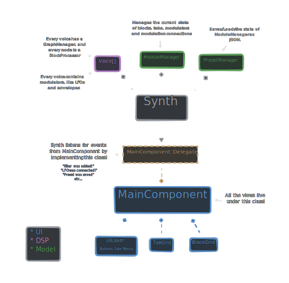

  <picture>
    <source media="(prefers-color-scheme: dark)" srcset="https://github.com/dan-german/blocks/blob/main/packaging/background.png?raw=true" />
      
    </picture>

  
	
**blocks is a modular synthesizer available as standalone, VST3 & AU for Windows and macOS.**

## How to use

[**Playthrough**](https://youtu.be/f-hJaOvzaT4?si=DZZIarRXv_In-7eQ)

At the center lies the block grid, where you can add sound sources and effects. Sound flows downwards, meaning any effect will shape the sound sources above it.

To the right stands the modulators menu, a space for adding LFOs and envelopes; And to the left you'll find the the modulation matrix, which controls connections between modulators and blocks.

Tabs, placed above the block grid, control which column of blocks activates when a note is played.

## Architecture

## Contributing 
If you're interesting in contributing, [**join our discord channel**](https://discord.gg/MjkFj859vW)!
